# Overview

## Service Outline

- [**MentorInterface**](https://gitlab.com/mentorgg/engine/mentor-interface)
    REST API exposed to the internet via an Ingress, providing authentication services and access to the Mentor Engine, and aggregates data from different sources.
- [**RabbitMQCluster**](https://gitlab.com/mentorgg/engine/rabbitmqcluster)
    Self-hosted RabbitMQ Cluster for internal AMQP queues between services.
- **CS:GO**:
    - [**DemoCentral**](https://gitlab.com/mentorgg/csgo/democentral)
        Orchestrate demo acquisition and analysis.
    - [**DemoDownloader**](https://gitlab.com/mentorgg/csgo/demodownloader)
        Download demos either from URL or file stream.
    - [**DemoFileWorker**](https://gitlab.com/mentorgg/csgo/demofileworker)
        Obtain raw match data from a demo file and enriches the result.
    - [**MatchDBI**](https://gitlab.com/mentorgg/csgo/matchdbi)
        Store and retrieve match data.
    - [**SituationOperator**](https://gitlab.com/mentorgg/csgo/situationsoperator)
        Store, retrieve and compute situation data, e.g. misplays.
    - [**FaceitMatchGatherer**](https://gitlab.com/mentorgg/csgo/faceitmatchgatherer)
        Poll Faceit API for new matches.
    - [**SharingCodeProjects**](https://gitlab.com/mentorgg/csgo/sharingcodeprojects)
        Poll Steam SharingCode API for new matches.
    - [**ConfigurationDBI**](https://gitlab.com/mentorgg/csgo/configurationdbi)
        Provide configuration data to other services (e.g. Equipment, Ingame2Px conversion parameters).
    - [**SteamUserProjects**](https://gitlab.com/mentorgg/engine/steamuserprojects)
        Provide info about steam users.
    - [**MatchEntities**](https://gitlab.com/mentorgg/csgo/matchentities)
        Classes for data extracted from demos referenced by multiple projects.

## Information Flow

```mermaid
graph TD;
    I["🌎"] --- MI
    MI --- UDB((UserDB));
    
    MI --- SUO[SteamUserOperator];
    
    MI --- SCO[SharingCodeGatherer];
    SCO --- SWC[SteamworksConnection];
    SCO -.- DC;
    
    MI --- FG[FaceitMatchGatherer];
    FG -.- DC;
    
    
    MI --- CDBI[ConfigurationDBI];
    
    MI[MentorInterface] --- DC[DemoCentral];
    DC -.- DD[DemoDownloader];
    DC -.- DFW[DemoFileWorker];
    DFW -.- MEF["MatchEntities Fanout"];
    MEF -.- MDBI;
    MEF -.- SO;
    
    CDBI --- DFW;

    CDBI --- CDB((ConfigurationDB));
    MI --- MDBI[MatchDBI];
    MI --- SO[SituationOperator];
    SO --- SDB((SituationDB));
    MDBI --- MDB((MatchDB));

    RC["🐰 RabbitMQCluster"];

    subgraph Legend
        AMQPP["AMQP Producer"] -.- AMQPC["AMQP Consumer"];
        HTTPC["HTTP Client"] --- HTTPS["HTTP Server"];
    end

    classDef db fill:white;
    classDef queue fill:pink;
    class RFO queue;
    class UDB,SUDB,CDB,SDB,MDB db;

    click MI,UDB "https://gitlab.com/mentorgg/engine/mentor-interface";
    click SUO "https://gitlab.com/mentorgg/engine/steamuserprojects";
    click SCO,SWC "https://gitlab.com/mentorgg/csgo/sharingcodeprojects";
    click CDBI,CDB "https://gitlab.com/mentorgg/csgo/configurationdbi";
    click DC "https://gitlab.com/mentorgg/csgo/democentral";
    click FG "https://gitlab.com/mentorgg/csgo/faceitmatchgatherer";
    click DFW "https://gitlab.com/mentorgg/csgo/demofileworker";
    click DD "https://gitlab.com/mentorgg/csgo/demodownloader";
    click MDBI,MDB "https://gitlab.com/mentorgg/csgo/matchdbi";
    click RC "https://gitlab.com/mentorgg/engine/rabbitmqcluster";
    click MEF "https://gitlab.com/mentorgg/csgo/matchentities";
    click SO,SDB "https://gitlab.com/mentorgg/csgo/situationsoperator";


    
```

