# Overview
Below is an overview over the MENTOR.GG code repositories and service structure. The service was discontinued in 2020.

## Documentation
- [**Design**](https://github.com/KieronKretschmar/MentorGG_ArchitectureDocumentation)
    Architecture design documentation.
- [**Implementation**](https://github.com/KieronKretschmar/MentorGG_ImplementationDocumentation)
    Collection of code snippets and design practices.

## Service Outline
- **Frontend**
    - [**Vue-WebApp**](https://github.com/KieronKretschmar/MentorGG_Frontend)
        The MENTOR.GG Vue app.
- **Infrastructure**
    - [**MentorInterface**](https://github.com/KieronKretschmar/MentorGG_Interface)
        REST API exposed to the internet via an Ingress, providing authentication services and access to the Mentor Engine, and aggregates data from different sources.
    - [**RabbitCommunicationLib**](https://github.com/KieronKretschmar/MentorGG_RabbitCommunicationLib)
        Self-hosted RabbitMQ Cluster for internal AMQP queues between services.
- **CS:GO**:
    - [**DemoCentral**](https://github.com/KieronKretschmar/MentorGG_DemoCentral)
        Orchestrate demo acquisition and analysis.
    - [**DemoDownloader**](https://github.com/KieronKretschmar/MentorGG_DemoDownloader)
        Download demos either from URL or file stream.
    - [**DemoFileWorker**](https://github.com/KieronKretschmar/MentorGG_DemoFileWorker)
        Obtain raw match data from a demo file and enriches the result.
    - [**MatchWriter**](https://github.com/KieronKretschmar/MentorGG_MatchWriter)
        Write match data to Match Database.
    - [**MatchRetriever**](https://github.com/KieronKretschmar/MentorGG_MatchRetriever)
        Retrieve data from Match Database.
    - [**SituationOperator**](https://github.com/KieronKretschmar/MentorGG_SituationOperator)
        Store, retrieve and compute situation data, e.g. misplays.
    - [**FaceitMatchGatherer**](https://github.com/KieronKretschmar/MentorGG_FaceitMatchGatherer)
        Poll Faceit API for new matches.
    - [**SharingCodeGatherer**](https://github.com/KieronKretschmar/MentorGG_SharingCodeGatherer)
        Poll Steam SharingCode API for new SharingCodes.
    - [**SteamworksService**](https://github.com/KieronKretschmar/MentorGG_SteamworksService)
       Translates SharingCodes into demo download urls.
    - [**SteamUserOperator**](https://github.com/KieronKretschmar/MentorGG_SteamUserOperator)
        Provide info about steam users.
    - [**MatchEntities**](https://github.com/KieronKretschmar/MentorGG_MatchEntities)
        Classes for data extracted from demos referenced by multiple projects.
    - [**MatchDatabase**](https://github.com/KieronKretschmar/MentorGG_MatchDb)
        Provides a Database context for MatchEntitites, referenced by e.g. MatchWriter and MatchRetriever

## Information Flow

```mermaid
graph TD;
    I["🌎"] --- MI
    MI === UDB((UserDB));
    
    MI --- SUO[SteamUserOperator];
    
    MI --- SCG["SharingCodeGatherer 💾"];
    SCG -.-> |sharing-code-instructions| SWS[SteamworksService];
    SWS -.-> |demo-insert-instructions| DC;
    
    MI --- FG["FaceitMatchGatherer 💾"];
    FG -.-> |demo-insert-instructions| DC;
    
    
    
    MI[MentorInterface] --- DC["DemoCentral 💾"];
    DC -.-> |demo-download-instructions| DD[DemoDownloader];
    DC -.-> |demo-analyze-instructions| DFW[DemoFileWorker];
    DFW -.-> MDSF["MatchDataSet Fanout"];
    DFW --- MDR["MatchDataRedis"];

    MDR --- MW1;
    MDR --- MW2;

    MDSF -.-> MW1["MatchWriter"];
    MR[MatchRetriever] === DMDB; 
    MW1 === DMDB((Durable MatchDb))
    MI --- MR

    MDSF -.-> MW2["MatchWriter"];
    MW2 === TMDB((Temp MatchDb))
    SO === TMDB;
    

    MI --- SO["SituationOperator 💾"];

    classDef db fill:white;
    classDef queue fill:pink;
    class RFO queue;
    class UDB,SUDB,CDB,SDB,MDB db;

    click MI,UDB "https://gitlab.com/mentorgg/engine/mentor-interface";
    click SUO "https://gitlab.com/mentorgg/engine/steamuseroperator";
    click SCG "https://gitlab.com/mentorgg/csgo/sharingcodegatherer";
    click SWS "https://gitlab.com/mentorgg/csgo/steamworksservice";
    click DC "https://gitlab.com/mentorgg/csgo/democentral";
    click FG "https://gitlab.com/mentorgg/csgo/faceitmatchgatherer";
    click DFW "https://gitlab.com/mentorgg/csgo/demofileworker";
    click DD "https://gitlab.com/mentorgg/csgo/demodownloader";
    click MW1,MW2 "https://gitlab.com/mentorgg/csgo/matchwriter";
    click MR "https://gitlab.com/mentorgg/csgo/matchretriever";
    click MDSF "https://gitlab.com/mentorgg/csgo/matchentities";
    click SO,SDB "https://gitlab.com/mentorgg/csgo/situationsoperator";
```

```mermaid
graph TD;
    subgraph Legend
        AMQPP["AMQP Producer"] -.-> AMQPC["AMQP Consumer"];
        HTTPC["HTTP Client"] --- HTTPS["HTTP Server"];
        S["Service"] === DB(("Database"));
        SWDB["Service with attached DB 💾"]
    end
```

